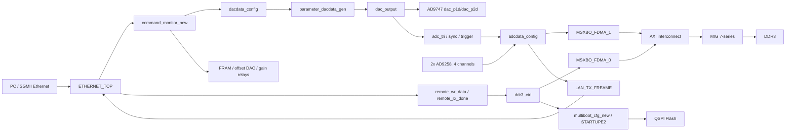

# FPGA Project Guide - AXI_DDR / SGSC_SEM_325T_V3_171

## 目录

- [0. 总体结论](#0-总体结论)
- [1. 工程入口与系统边界](#1-工程入口与系统边界)
- [2. 时钟与复位](#2-时钟与复位)
- [3. 工程总体架构图](#3-工程总体架构图)
- [4. 模块层级关系](#4-模块层级关系)
- [5. 主数据链路](#5-主数据链路)
- [6. 控制通路](#6-控制通路)
- [7. 存储与缓冲](#7-存储与缓冲)
- [8. 验证与上板](#8-验证与上板)
- [9. 需要深入阅读的关键文件](#9-需要深入阅读的关键文件)
- [10. 待确认问题与风险](#10-待确认问题与风险)
- [11. 下一步阅读路线](#11-下一步阅读路线)

## 0. 总体结论

这是一个 Vivado 工程，综合顶层是 `ETH_TOP`，器件是 `xc7k325tffg676-2`。工程名字叫 `AXI_DDR`，但从顶层端口和例化关系看，真正业务核心不是单纯的以太网或 DDR，而是一个带以太网控制的扫描采集系统：

1. PC 通过 SGMII 以太网写寄存器，配置扫描、采样、增益、偏置和远程升级参数。
2. DAC 链路根据参数生成双路 AD9747 波形，同时产生 ADC 采集触发和同步输出。
3. 两片 AD9258 提供 4 路 ADC 数据，按通道选择、平均/抽取后打包成 64-bit 数据写入 DDR3，再读出并经以太网发送。
4. 远程升级/配置数据也从以太网进入，先落 DDR3，再被读出送到 QSPI/multiboot 相关逻辑。

本轮只做工程阅读，没有修改 RTL。以下结论来自当前工程文件和源码连接关系。

## 1. 工程入口与系统边界

### 1.1 工程入口表

| 项目 | 结论 |
|---|---|
| 工程文件 | `AXI_DDR.xpr` |
| 器件型号 | `xc7k325tffg676-2`，见 `AXI_DDR.xpr:10` |
| 顶层模块 | `ETH_TOP`，见 `AXI_DDR.xpr:638` |
| 顶层文件 | `AXI_DDR.srcs/sources_1/new/ETH_TOP.v`，模块声明见 `ETH_TOP.v:21` |
| 主约束文件 | `AXI_DDR.srcs/constrs_1/new/fpga_pin.xdc`，见 `AXI_DDR.xpr:643` 和 `AXI_DDR.xpr:650` |
| BD 入口 | `AXI_DDR.srcs/sources_1/bd/system/system.bd` |
| BD wrapper | `AXI_DDR.gen/sources_1/bd/system/hdl/system_wrapper.v` |
| 主要源码目录 | `AXI_DDR.srcs/sources_1/new`、`AXI_DDR.srcs/sources_1/imports`、`AXI_DDR.srcs/sources_1/ip`、`user_src/MSXBO_FDMA_1.0` |
| 仿真入口 | `AXI_DDR.srcs/sim_1/new/fram_test.v`，见 `AXI_DDR.xpr:656` |

### 1.2 系统边界表

| 接口类别 | 外部信号 | 方向 | 连接外设 | 主/支撑 | 服务的数据链路 |
|---|---|---|---|---|---|
| 系统时钟 | `sys_clk` | 输入 | 板级 100 MHz 时钟 | 支撑 | 全系统 PLL/MMCM 输入 |
| DAC 数据 | `dac_p1d[15:0]`, `dac_p2d[15:0]`, `dac_dco` | 输出/输入 | AD9747 | 主 | DAC 扫描输出 |
| ADC 数据 | `adc1_da/db[15:0]`, `adc2_da/db[15:0]`, `adc*_dco*` | 输入 | 两片 AD9258，4 路通道 | 主 | ADC 采集到 DDR/以太网上传 |
| 以太网 | `gtrefclk_p/n`, `txp/txn_sgmii`, `rxp/rxn_sgmii`, MDIO/MDC | 输入/输出 | SGMII PHY | 主/支撑 | 寄存器控制、ADC 数据回传、远程升级 |
| DDR3 | `DDR3_addr/ba/dq/dqs/...` | 输入/输出 | 外部 DDR3 | 主缓冲 | ADC 数据缓存、远程升级数据缓存 |
| QSPI | `qspi_d[3:0]`, `qspi_csb` | 输入/输出 | QSPI Flash | 支撑 | 远程升级/multiboot |
| FRAM | `FRAM_SCL`, `FRAM_SDA` | 输入/输出 | FRAM | 支撑 | 偏置/板级配置保存 |
| 偏置 DAC/I2C | `ADC1_SCL/SDA`, `ADC2_SCL/SDA` | 输入/输出 | 偏置 DAC/板级 I2C | 支撑 | 模拟偏置配置 |
| 触发同步 | `TRIGGER_IN`, `TRIGGER_OUT`, `TRIG_*` | 输入/输出 | 外部同步/触发口 | 主/支撑 | DAC 触发 ADC，外部同步输出 |
| 板级控制 | `LED`, `FAN`, `UART_*` | 输入/输出 | 指示灯、风扇、UART | 支撑 | 状态/调试 |

关键端口证据：`ETH_TOP.v:21-137` 给出完整顶层端口，`fpga_pin.xdc:25-27` 约束 `sys_clk`，`fpga_pin.xdc:206` 约束 `dac_dco`，`fpga_pin.xdc:294-295` 与 `fpga_pin.xdc:383-384` 约束 ADC DCO，`fpga_pin.xdc:409-411` 约束 SGMII 参考时钟。

## 2. 时钟与复位

| 时钟 | 来源 | 频率 | 覆盖模块 | 服务的数据链路 | CDC 风险 |
|---|---|---|---|---|---|
| `sys_clk` | 外部端口 | 100 MHz | `sysclk` IP 输入 | 全局时钟源 | 低，作为 PLL 输入 |
| `clk200m` | `sysclk.clk_out1` | 200 MHz | `system_wrapper` / MIG 输入 | DDR3 / FDMA | 中，进入 BD 后生成 `ui_clk` |
| `clk10m` | `sysclk.clk_out2` | 10 MHz | AD9517/AD9747/AD9258 配置、FRAM/offset DAC 延时 | 低速 SPI/I2C 配置 | 低 |
| `clk50m` | `sysclk.clk_out3` | 50 MHz | Ethernet config、`FPGA_50M` ODDR、QSPI 读出段 | 以太网配置/QSPI 支撑 | 中 |
| `ui_clk` | MIG `ui_clk` | 200 MHz | FDMA、DDR 控制、ADC 打包读写 | ADC/remote 到 DDR | 中，跨 ADC/ETH/DAC 域 |
| `eth_clk` | `ETHERNET_TOP.user_axis_clk` | 待确认，通常来自 TEMAC 用户时钟 | 以太网协议、寄存器、部分控制 | PC 控制、UDP 数据 | 中 |
| `dac_dco` | 外部 DAC DCO | 50 MHz | `dac_output` | DAC 数据输出 | 中，参数通过 FIFO 从 `eth_clk` 进入 |
| `adc*_dco*` | 外部 ADC DCO | 50 MHz | `adcdata_acq` | ADC 数据采集 | 高，4 个采样时钟进 `ui_clk` 汇合 |
| `gtrefclk` | 外部 SGMII 参考时钟 | 125 MHz | TEMAC/PHY | 以太网物理层 | 由 IP 约束处理 |

时钟证据：`ETH_TOP.v:196-202` 例化 `sysclk` 并输出 `clk200m/clk10m/clk50m`；`system.bd:113-115` 标注 `ui_clk` 为 200 MHz；`system.bd:1130-1134` 将 `clk200m` 接到 MIG `sys_clk_i/clk_ref_i`；`system.bd:1143-1154` 将 MIG `ui_clk` 接到两个 FDMA、reset、AXI interconnect 和 ILA；`dac_output.v:44-49` 将 `dac_dco` BUFG 后作为 DAC 输出域；`adcdata_acq.v:41` 将 reset 同步到 ADC DCO 域。

## 3. 工程总体架构图

当前环境没有找到 D2 命令，因此这里先用 Mermaid 画第一版架构图，便于在 Markdown 里直接预览。

## 4. 模块层级关系

| 层级 | 模块/文件 | 作用 | 证据 |
|---|---|---|---|
| 顶层 | `ETH_TOP` / `AXI_DDR.srcs/sources_1/new/ETH_TOP.v` | 板级端口、时钟、DDR wrapper、以太网、ADC/DAC、远程升级和偏置配置的总集成 | `ETH_TOP.v:21-137` |
| 时钟 | `sysclk` IP | 100 MHz 输入生成 200/10/50 MHz | `ETH_TOP.v:196-202` |
| 以太网 | `ETHERNET_TOP` / active import copy | SGMII MAC/PHY、ARP/ICMP/UDP、寄存器读写、ADC 数据发送、远程数据接收 | `ETH_TOP.v:302-345`, `imports/ethernet/ETHERNET_TOP.v:21-64` |
| 寄存器控制 | `command_monitor_new` | 将以太网寄存器写入转成扫描、采样、增益、偏置、remote reset 等控制参数 | `ETH_TOP.v:427-482`, `command_monitor_new.v:21-79` |
| DDR/AXI | `system_wrapper` / `system.bd` | 两个 MSXBO_FDMA master 经 AXI interconnect 访问 MIG DDR3 | `ETH_TOP.v:378-423`, `system_wrapper.v:12-191`, `system.bd:1037-1053` |
| ADC 链路 | `adcdata_config` | 4 路 AD9258 采样、平均/抽取、通道选择、写 DDR、读 DDR、以太网打包 | `ETH_TOP.v:489-538`, `adcdata_config.v:21-72` |
| ADC 单通道 | `adcdata_acq` | 每个 ADC 通道在 DCO 域采样、按 `adc_sample/interval` 求平均，送 FIFO | `adcdata_config.v:137-207`, `adcdata_acq.v:21-38` |
| ADC 通道打包 | `adcdata_get` | 按 `adc_channel` 选择 1/2/4 通道并打包为 64-bit | `adcdata_config.v:209-224`, `adcdata_get.v:21-35` |
| DAC 链路 | `dacdata_config` | 根据寄存器参数生成 DAC 波形配置 FIFO，输出 DAX/DAY 与触发 | `ETH_TOP.v:546-582`, `dacdata_config.v:21-58` |
| DAC 参数生成 | `parameter_dacdata_gen` | 生成 `{sync2,sync1,adc_tri,DAX,DAY}` 35-bit 参数流 | `parameter_dacdata_gen.v:69-74` |
| DAC 输出 | `dac_output` | 从参数 FIFO 跨到 `dac_dco` 域，驱动 DAX/DAY 和同步脉冲 | `dac_output.v:76-164` |
| 远程升级缓存 | `ddr3_ctrl` | 将 remote 数据写 DDR，再读出给 multiboot/QSPI | `ETH_TOP.v:635-663`, `ddr3_ctrl.v:25-53` |
| QSPI/multiboot | `multiboot_cfg_new`, `STARTUPE2` | 处理远程配置数据并驱动 QSPI CCLK/CS/DQ | `ETH_TOP.v:593-629` |
| 非易失配置 | `fram_cfg`, `offset_dac_cfg` | FRAM 保存/读取偏置，offset DAC/I2C 输出模拟偏置 | `ETH_TOP.v:673-711` |

## 5. 主数据链路

### 5.1 主数据链路识别结论

| 链路编号 | 主链路依据 | 吞吐量估算 | 数据源 | 主要模块路径 | 数据终点 | 数据类型 | 备注 |
|---|---|---|---|---|---|---|---|
| DL1 | DAC 端口是顶层实数输出，且生成 ADC 触发 | 2 x 16-bit x 50 MHz，约 1.6 Gb/s 原始并口 | 以太网寄存器配置 | `command_monitor_new` -> `dacdata_config` -> `parameter_dacdata_gen` -> `dac_output` | AD9747 `dac_p1d/p2d`，同步/触发输出 | 扫描波形、触发脉冲 | 主输出链路 |
| DL2 | ADC 端口是顶层实数输入，进入 DDR 后回传以太网 | 原始 4 x 14-bit x 50 MHz，约 2.8 Gb/s；实际经平均/抽取降低 | 两片 AD9258，4 路通道 | `adcdata_config` -> `adcdata_acq` -> `adcdata_get` -> `fdma_controller1_write/read` -> `LAN_TX_FREAME` | DDR3 与 SGMII 以太网 | ADC 平均/采集数据 | 主采集链路 |
| DL3 | remote 数据流由以太网进入 DDR/QSPI，用于升级/配置 | 16-bit remote 写入，DDR 段 64-bit，QSPI 段 4-bit | Ethernet remote payload | `ETHERNET_TOP` -> `ddr3_ctrl` -> `fdma_controller_write/read` -> `multiboot_cfg_new` | QSPI Flash / multiboot | 固件或远程配置流 | 支撑但业务重要 |
| DL4 | PC 写寄存器直接决定 DL1/DL2 行为 | 32-bit 寄存器读写 | Ethernet UDP/reg packet | `ETHERNET_TOP` -> `WR_RD_REG_TOP` -> `command_monitor_new` | 扫描/采样/DAC/ADC/偏置控制寄存器 | 控制参数 | 控制链路 |

### 5.2 数据链路 1 - DAC 扫描输出与触发

数据方向：

`PC/ETH` -> `WR_REG_*` -> `command_monitor_new` -> `dacdata_config` -> `parameter_dacdata_gen` -> async FIFO -> `dac_output` -> `DAX_DATA/DAY_DATA` -> `dac_p1d/dac_p2d`

关键事实：

- 顶层将 `DAX_DATA/DAY_DATA` 反相后送到 AD9747 并口：`assign dac_p1d = 65535 - DAX_DATA`、`assign dac_p2d = 65535 - DAY_DATA`，见 `ETH_TOP.v:542-545`。
- `dacdata_config` 接收 `dac_sample/image_row/dacx_* / dacy_* / scan_mode / ultrafast_mode / TRIGGER_IN` 等参数，见 `dacdata_config.v:21-58`。
- `parameter_dacdata_gen` 产生 35-bit 参数流 `{sync_pixel_tri2,sync_pixel_tri1,adc_tri,DAX_DATA,DAY_DATA}`，见 `parameter_dacdata_gen.v:69-74`。
- `dac_output` 用 `fifo_generator_4` 将参数从 `eth_clk` 域送到 `dac_dco` 域，并在 `dac_dco` 域更新 `DAX_DATA/DAY_DATA/adc_tri`，见 `dac_output.v:76-164`。
- `adc_tri` 直接驱动 ADC 采集链路，`sync_pixel_tri2` 还被顶层送到 `TRIGGER_OUT`，见 `ETH_TOP.v:486-487`。

### 5.3 数据链路 2 - ADC 采集到 DDR3，再经以太网上传

数据方向：

`AD9258 adc*_dco + adc*_data` -> `adcdata_acq` x4 -> `adcdata_get` -> 64-bit `adc_data_mix` -> `fdma_controller1_write` -> `MSXBO_FDMA_1` -> AXI -> MIG/DDR3 -> `fdma_controller1_read` -> `LAN_TX_FREAME` -> `ETHERNET_TOP`

关键事实：

- 顶层只把每个 ADC 的 `[15:2]` 送入 `adcdata_config`，也就是 14-bit 数据补 2-bit 到 16-bit 处理，见 `ETH_TOP.v:498-501` 与 `adcdata_config.v:31-34`。
- `adcdata_config` 为 4 个 ADC DCO 分别 BUFG，再例化 4 个 `adcdata_acq`，见 `adcdata_config.v:88-110` 和 `adcdata_config.v:137-207`。
- `adcdata_acq` 在 ADC DCO 域同步触发和参数，按 `adc_sample/adc_interval/adc_acq_delay/acq_dead_time` 进行采样与求平均，见 `adcdata_acq.v:65-91`、`adcdata_acq.v:100-115`、`adcdata_acq.v:208-247`。
- `adcdata_get` 根据 `adc_channel` 等待所选通道 FIFO 深度，然后把 1/2/4 路 16-bit 样本打包成 64-bit，见 `adcdata_get.v:57-127`。
- 写 DDR 使用 `fdma_controller1_write`，当 FIFO 中至少 128 个 64-bit word 时申请一次 burst，地址每次加 1024 byte，见 `fdma_controller1_write.v:36-40`、`fdma_controller1_write.v:83-93`、`fdma_controller1_write.v:103-110`。
- 读 DDR 使用 `fdma_controller1_read`，当缓存量大于等于 2048 byte 且以太网请求有效时读出 128 个 64-bit word，见 `fdma_controller1_read.v:49-75`、`fdma_controller1_read.v:92-109`。
- `LAN_TX_FREAME` 把 `pkg_rd_data` 转为 8-bit `data_tx_data/data_tx_valid` 给以太网发送，见 `adcdata_config.v:255-280` 和 `ETHERNET_TOP.v:50-57`。

### 5.4 数据链路 3 - Ethernet remote 数据到 DDR3/QSPI

数据方向：

`ETHERNET_TOP remote_wr_data` -> `ddr3_ctrl` -> `fdma_controller_write` -> `MSXBO_FDMA_0` -> DDR3 -> `fdma_controller_read` -> 4-bit `data_in` -> `multiboot_cfg_new` -> QSPI/STARTUPE2

关键事实：

- `ETHERNET_TOP` 输出 `remote_len/remote_wr_en/remote_wr_data/remote_rx_done`，见 `ETH_TOP.v:340-345`。
- 顶层把这些 remote 信号同时送到 `multiboot_cfg_new` 和 `ddr3_ctrl`，见 `ETH_TOP.v:593-613` 与 `ETH_TOP.v:635-663`。
- `fdma_controller_write` 使用 `fifo_generator_10` 做 `eth_clk` 到 `ui_clk` 的 16-bit 到 64-bit 宽度转换，见 `fdma_controller_write.v:110-118`。
- `fdma_controller_read` 从 DDR3 读出 64-bit 数据，先用 `fifo_generator_5` 转 32-bit，再用 `fifo_generator_8` 从 `ui_clk` 跨到 `clk_50m` 并转成 4-bit `data_in`，见 `fdma_controller_read.v:134-172`。
- `STARTUPE2` 将 `qspi_clk` 接入配置 CCLK，见 `ETH_TOP.v:615-629`。

### 5.5 数据链路 4 - Ethernet 寄存器控制

数据方向：

`Ethernet RX` -> `ETH_LAN_RX` -> `WR_RD_REG_TOP` -> `WR_REG_VALID/ADDR/DATA` -> `command_monitor_new` -> 控制寄存器 -> DAC/ADC/remote/offset

关键事实：

- `ETHERNET_TOP` 对外提供 `WR_REG_*` 和 `RD_REG_*`，见 `imports/ethernet/ETHERNET_TOP.v:41-48`。
- 顶层将其接到 `command_monitor_new`，见 `ETH_TOP.v:427-435`。
- `command_monitor_new` 的输出几乎覆盖全部业务参数：采样长度、通道、DAC/ADC sample、增益、图像尺寸、DAC 起止电平、扫描模式、偏置、ultrafast 模式等，见 `command_monitor_new.v:31-79`。

## 6. 控制通路

| 控制信号/状态机 | 来源类型 | 来源模块 | 作用位置 | 约束的数据链路 | 说明 |
|---|---|---|---|---|---|
| `WR_REG_VALID/ADDR/DATA` | Ethernet 寄存器写 | `ETHERNET_TOP` | `command_monitor_new` | DL1/DL2/DL3/DL4 | PC 侧主控制入口 |
| `scan_state` | 寄存器 `0x0009[3:0]` | `command_monitor_new` | `adcdata_config`, `dacdata_config` | DL1/DL2 | 启停扫描/采集 |
| `scan_mode` | 寄存器 `0x0009[7:4]` | `command_monitor_new` | `dac_output` | DL1 | 当前只明显看到参数扫描模式 `4'h1` |
| `adc_sample`, `dac_sample` | 寄存器 `0x0002` | `command_monitor_new` | ADC 平均、DAC 参数生成 | DL1/DL2 | 默认 50 |
| `adc_len_single`, `adc_channel` | 寄存器 `0x0001` | `command_monitor_new` | ADC 打包与 LAN frame | DL2 | `adc_channel` 决定 1/2/4 路通道组合 |
| `image_row`, `image_column` | 寄存器 `0x0004` | `command_monitor_new` | DAC/ADC 行列、点数 | DL1/DL2 | `image_point = row * column` |
| `dacx_*`, `dacy_*` | 寄存器 `0x0005-0x0008/0x000F` | `command_monitor_new` | `parameter_dacdata_gen` | DL1 | 起止电平、步进、等待、恢复 |
| `adc_interval`, `adc_acq_delay`, `acq_dead_time` | 寄存器 `0x0009/0x0201/0x0204` | `command_monitor_new` | `adcdata_acq` | DL2 | 控制采样间隔和有效点 |
| `ultrafast_mode`, `ultrafast_line_rec` | 寄存器 `0x0202` | `command_monitor_new` | DAC/ADC | DL1/DL2 | 快速模式分支 |
| `remote_rstn` | 寄存器 `0x000C` | `command_monitor_new` | `ETHERNET_TOP`, `ddr3_ctrl` | DL3 | remote 数据写 DDR 的复位/使能 |
| `wr_offset_flag`, `offset_*` | 寄存器 `0x0010-0x0012` | `command_monitor_new` | `fram_cfg`, `offset_dac_cfg` | 支撑 | 偏置保存与输出 |

主要寄存器写入逻辑见 `command_monitor_new.v:191-281`，读回逻辑见 `command_monitor_new.v:291-318`。

## 7. 存储与缓冲

| 存储结构 | 所在模块 | 服务的数据链路 | 解决的问题 |
|---|---|---|---|
| DDR3 / MIG 7-series | `system.bd`, `system_wrapper` | DL2/DL3 | 大容量缓存 ADC 数据和 remote 数据 |
| `MSXBO_FDMA_0` | `system.bd` | DL3 | remote 数据通过 AXI master 访问 DDR |
| `MSXBO_FDMA_1` | `system.bd` | DL2 | ADC 数据通过 AXI master 访问 DDR |
| AXI interconnect + upsize | `system.bd` | DL2/DL3 | 两个 64-bit FDMA master 汇聚到 256-bit MIG S_AXI |
| `fifo_generator_3` | `fdma_controller1_write` | DL2 | ADC 64-bit 打包数据进入 FDMA 写 burst |
| `fifo_generator_10` | `fdma_controller_write` | DL3 | remote 16-bit `eth_clk` 到 64-bit `ui_clk` |
| `fifo_generator_5` | `fdma_controller_read` | DL3 | DDR 64-bit 读出转 32-bit |
| `fifo_generator_8` | `fdma_controller_read` | DL3 | 32-bit `ui_clk` 到 4-bit `clk_50m`，给 multiboot/QSPI |
| `fifo_generator_4` | `dac_output` | DL1 | 35-bit DAC 参数从 `eth_clk` 跨到 `dac_dco` |
| `fifo_generator_1` + `row_repeat_module` | `adcdata_acq` | DL2 | ADC 平均结果缓存与行重复处理 |
| FRAM | `fram_cfg` | 支撑 | 偏置/配置参数非易失保存 |
| QSPI Flash | `multiboot_cfg_new` | DL3 | 远程升级镜像存储 |

DDR3 参数证据：MIG 配置为 `MT41K256M16XX-125`，数据宽度 64，`C0_MEM_SIZE=2147483648`，`C0_S_AXI_DATA_WIDTH=256`，见 `mig_a.prj:43`、`mig_a.prj:55`、`mig_a.prj:67`、`mig_a.prj:217-218`。BD 中两个 FDMA 数据宽度都是 64，AXI interconnect 有 64 到 256 的 data width converter，见 `system.bd:244-248`、`system.bd:278-282`、`system.bd:848-853`。

## 8. 验证与上板

| 资源 | 文件/模块 | 对应数据链路 | 用途 |
|---|---|---|---|
| ILA `pkg_rd_ila`, `pkg_wr_ila` | `adcdata_config` | DL2 | 看 ADC DDR 读写请求、地址、数据、last |
| ILA `ila_6` | `fdma_controller1_read` | DL2 | 看 ADC DDR 读出缓存量 |
| ILA `ila_8` | `adcdata_acq` | DL2 | 看 ADC 触发、有效点、平均、行计数 |
| ILA `ila_6` | `adcdata_get` | DL2 | 看通道打包和 64-bit 输出 |
| ILA `sync1_test/sync2_test` | `dac_output` | DL1 | 看同步脉冲宽度、延时和状态机 |
| ILA `ila_2` | `dac_output` | DL1 | 看 DAC 输出数据和同步触发 |
| VIO `vio_1` | `ETH_TOP` | DDR/复位 | `aux_reset` 注入到 BD reset |
| VIO/ILA in Ethernet | `ETHERNET_TOP` | DL3/DL4 | ARP、UDP、寄存器、remote 数据调试 |
| 仿真入口 | `AXI_DDR.srcs/sim_1/new/fram_test.v` | 支撑 | 当前工程登记的仿真文件 |

建议上板验证顺序：

1. 先看 `sys_clk/locked/clk200m/ui_clk/fdma_rstn/eth_rstn/link_up`，确认时钟和复位成立。
2. 写 `command_monitor_new` 基础寄存器，读回 `0x000A` 版本号和关键配置寄存器。
3. 单独验证 DAC：写扫描参数，观察 `DAX_DATA/DAY_DATA/adc_tri/sync_pixel_tri*`。
4. 单独验证 ADC：用固定触发/小采样量，看 `adcdata_acq` 平均输出和 `adcdata_get` 64-bit 打包。
5. 验证 ADC 到 DDR：看 `pkg1_wr_areq/pkg1_wr_en/pkg1_wr_last/pkg1_wr_addr` 是否 1024 byte 步进。
6. 验证 DDR 到以太网：看 `pkg1_rd_*` 和 `data_req/data_ACK/data_tx_valid/tx_data_done`。
7. 最后验证 remote upgrade：看 `remote_wr_en/remote_rx_done`、`pkg_wr_*`、`data_in_flag/data_in`、QSPI 引脚。

## 9. 需要深入阅读的关键文件

| 优先级 | 文件 | 需要重点看的内容 |
|---|---|---|
| P0 | `AXI_DDR.srcs/sources_1/new/ETH_TOP.v` | 顶层端口、主模块例化、信号总连接 |
| P0 | `AXI_DDR.srcs/sources_1/new/adcdata_config.v` | ADC 4 通道到 DDR/以太网的总控制 |
| P0 | `AXI_DDR.srcs/sources_1/new/dacdata_config.v` | DAC 参数生成和触发关系 |
| P0 | `AXI_DDR.srcs/sources_1/new/command_monitor_new.v` | PC 寄存器地图和默认参数 |
| P0 | `AXI_DDR.srcs/sources_1/bd/system/system.bd` | FDMA/MIG/AXI interconnect 连接 |
| P1 | `AXI_DDR.srcs/sources_1/new/adcdata_acq.v` | ADC 采样、平均、有效点、CDC |
| P1 | `AXI_DDR.srcs/sources_1/new/adcdata_get.v` | 通道选择与 64-bit 数据打包 |
| P1 | `AXI_DDR.srcs/sources_1/new/fdma_controller1_write.v` | ADC 数据写 DDR burst 控制 |
| P1 | `AXI_DDR.srcs/sources_1/new/fdma_controller1_read.v` | ADC 数据读 DDR 和以太网发送触发 |
| P1 | `AXI_DDR.srcs/sources_1/new/parameter_dacdata_gen.v` | DAC 波形算法和触发生成 |
| P1 | `AXI_DDR.srcs/sources_1/new/dac_output.v` | DAC 输出域、参数 FIFO、同步脉冲 |
| P1 | `AXI_DDR.srcs/sources_1/imports/ethernet/ETHERNET_TOP.v` | 活跃的以太网顶层，寄存器/UDP/remote 入口 |
| P2 | `AXI_DDR.srcs/sources_1/new/ddr3_ctrl.v` | remote 数据到 DDR/QSPI 的桥接 |
| P2 | `AXI_DDR.srcs/sources_1/new/multiboot_cfg_new.v` | QSPI/multiboot 细节 |
| P2 | `AXI_DDR.srcs/sources_1/new/fram_cfg.v` | 偏置参数保存 |
| P2 | `AXI_DDR.srcs/sources_1/new/offset_dac_cfg.v` | offset DAC/I2C 输出 |

## 10. 待确认问题与风险

### 已确认事实

| 问题 | 结论 | 证据文件 | 可信度 |
|---|---|---|---|
| 当前综合顶层 | `ETH_TOP` | `AXI_DDR.xpr:638`, `ETH_TOP.v:21` | 高 |
| 器件型号 | `xc7k325tffg676-2` | `AXI_DDR.xpr:10` | 高 |
| `ui_clk` 频率 | 200 MHz | `system.bd:113-115`, `ETH_TOP.v:396` | 高 |
| DDR3 数据宽度 | 物理 64-bit，MIG S_AXI 256-bit | `mig_a.prj:55`, `mig_a.prj:217-218` | 高 |
| FDMA 数据宽度 | 用户侧 64-bit | `system.bd:244-248`, `system.bd:278-282` | 高 |
| ADC 进入逻辑位宽 | 顶层取 `[15:2]`，进入 `adcdata_config` 为 14-bit 后补 2-bit | `ETH_TOP.v:498-501`, `adcdata_config.v:31-34`, `adcdata_config.v:150` | 高 |

### 待确认/风险

| 风险 | 说明 | 建议 |
|---|---|---|
| `command_monitor_new` 有重复 `16'h0200` case | `command_monitor_new.v:254-256` 写 `sync1_pixel_tri_wigth`，`command_monitor_new.v:271-273` 又写 `sync2_pixel_tri_wigth`。Verilog `case` 中后一个同值分支通常不可达，可能导致 sync2 宽度无法配置。 | 结合上位机协议确认是否应改为 `16'h0205` 或其他地址。 |
| active Ethernet 文件容易选错 | XPR 使用 `AXI_DDR.srcs/sources_1/imports/ethernet/ETHERNET_TOP.v`，而 `AXI_DDR.srcs/sources_1/new/ethernet/ETHERNET_TOP.v` 也存在且接口不同。 | 后续改 Ethernet 时先确认 XPR active source。 |
| `system_top.v` 不是当前顶层 | 该文件是旧的 HDMI/PCIe wrapper 风格，XPR 当前顶层为 `ETH_TOP`。 | 阅读时不要从 `system_top.v` 展开主工程。 |
| XPR 中有旧路径痕迹 | 若干 run 的 `AutoIncrementalDir` 指向历史工程路径。 | 迁移或重新综合前清理 runs/cache，确认相对路径。 |
| 以太网用户时钟频率未在顶层直接约束 | `eth_clk` 来自 TEMAC `user_axis_clk`，频率需要从 IP 生成约束/时序报告确认。 | 用 Vivado clock report 确认 `user_axis_clk`。 |
| 源码注释编码损坏 | 多处中文注释显示为乱码。 | 深读/交接前建议对关键文件重新整理注释，避免误读。 |
| 当前目录不是 git 仓库 | `git status` 报错，不便追踪改动。 | 如果要修改 RTL，建议先建立版本控制或备份工程。 |

## 11. 下一步阅读路线

建议下一轮按下面顺序做深读：

1. 先深读 DL2：`ADC -> adcdata_acq -> adcdata_get -> fdma_controller1_write/read -> LAN_TX_FREAME`。这是最复杂、也最容易出采样/CDC/吞吐问题的链路。
2. 再深读 DL1：`command_monitor_new -> parameter_dacdata_gen -> dac_output -> adc_tri/sync/DAC data`。这条链路决定扫描时序和 ADC 触发位置。
3. 然后核对上位机寄存器协议，重点确认 `0x0200` 重复地址、`adc_channel` 编码、`scan_mode` 有效值、remote upgrade 流程。
4. 最后看 `ddr3_ctrl/multiboot_cfg_new/fram_cfg/offset_dac_cfg` 等支撑链路。
